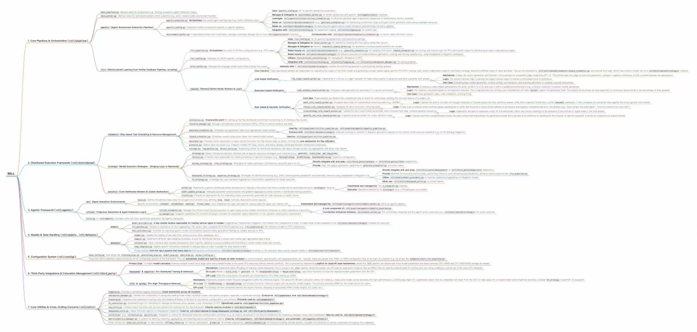

<div align="center">


# ROLL: Reinforcement Learning Optimization for Large-Scale Learning

<h4>🚀 An Efficient and User-Friendly Scaling Library for Reinforcement Learning with Large Language Models 🚀</h4>

<p>
  <a href="https://github.com/alibaba/ROLL/blob/main/LICENSE">
    
  </a>
  <a href="https://github.com/alibaba/ROLL/issues">
    
  </a>
  <a href="https://github.com/alibaba/ROLL/stargazers">
    
  </a>
  <a href="https://arxiv.org/abs/2506.06122"></a>
  <!-- 组织主页：点击跳转到 https://github.com/alibaba -->
  <a href="./assets/roll_wechat.png" target="_blank">
    
  </a>
</p>

</div>

ROLL is an efficient and user-friendly RL library designed for Large Language Models (LLMs) utilizing Large Scale GPU resources. It significantly enhances LLM performance in key areas such as human preference alignment, complex reasoning, and multi-turn agentic interaction scenarios.

Leveraging a multi-role distributed architecture with Ray for flexible resource allocation and heterogeneous task scheduling, ROLL integrates cutting-edge technologies like Megatron-Core, SGLang and vLLM to accelerate model training and inference.


---

## 📢 News

| 📣   Updates                                                                                                                                   |
|:-----------------------------------------------------------------------------------------------------------------------------------------------|
| **[06/13/2025]** Support Qwen2.5 VL rlvr pipeline and upgrade mcore to 0.12 version.                    |
| **[06/09/2025]** 🎉 ROLL tech report is now available! Access the report [here](https://arxiv.org/abs/2506.06122).                     |
| **[05/30/2025]** 🎉 Training RLVR and Agentic RL with ROLL is now available! Explore the new capabilities.                                     |
---

## 🗺️ Architecture at a Glance

New to **ROLL**? The interactive mind-map below gives you a bird’s-eye view of the library’s core modules, data flow, and training pipelines. Start here for a quick orientation before diving into the detailed guides.

<!-- Architecture mind-map -->
<p align="center">
  <!-- 1⃣ 这里跳转到高清 PNG -->
  <a href="./assets/ROLL_map_high.png" target="_blank">
    <!-- 2⃣ 小缩略图仍用 jpg（或低分辨率 png） -->
    
  </a><br>
  <sub>Click the image to view the <b>HD</b> version</sub>
</p>

---

## ✨ Key Features

ROLL is engineered to empower a diverse range of users in the LLM and RL landscape.

### <ins>🎯 For Tech Pioneers (e.g., Large AI Labs, Hyperscalers)</ins>

Seeking to lead the LLM community with large-scale GPU clusters? ROLL offers:

* 🚀 **Fast and Cost-Effective**: Fully exploits high-performance hardware, expediting RL training and achieving considerable reductions in training cost and time on large GPU clusters.
* 🔗 **Scalability and Fault Tolerance**: Supports a wide range of LLM training and serving optimization techniques, enabling scalable training of models up to 200B+ parameters across thousands of GPUs. Features an efficient checkpoint and resumption mechanism for minimal downtime.
* 🛠️ **Flexible Hardware Usage**: Supports RL training across various hardware types. Users can choose between colocation or disaggregation, and configure synchronous or asynchronous execution modes to fully leverage different hardware architectures.

### <ins>🧑‍💻 For Product Developers</ins>

Focused on enhancing in-house LLMs with human alignment, reasoning, and tool use? ROLL provides:

* 🔧 **Diverse and Extensible Rewards/Environments**: Implements a suite of `Reward Worker`s and `Environment Worker`s. Easily customize your own rewards and environments based on our existing implementations.
* 🧭 **Compositional Sample-Reward Route**: Provides a user-friendly interface to control prompt sampling ratios across tasks and dynamically route samples to appropriate `Reward Worker`s (e.g., mathematical verifiers, sandbox environments, LLM-as-a-judge). Essential for optimizing multi-capability production-level LLMs.
* ⚙️ **Easy Device-Reward Mapping**: Develops an interface for easy configuration of device mapping for `Reward Worker`s, isolating reward computation to prevent interference and performance bottlenecks in multi-task RL training.
* 📚 **Rich Training Recipes**: Offers a variety of RL algorithms (like GRPO/PPO/reinforce++/TOPR/RAFT++), LLMs, tasks, and datasets to reduce engineering effort for new training features.
* 🏆 **Superior Performance**: Includes a set of tuned training configurations that achieve satisfactory performance across many tasks, alleviating laborious hyperparameter searches.


### <ins>🔬 For Algorithm Researchers</ins>

Need flexible, fine-grained control for RL experiments, often with limited GPU access? ROLL delivers:

* 💡 **Constrained Device Execution**: Enables efficient training on limited GPU resources (including single-GPU setups) via memory optimization techniques, facilitating rapid trial-and-error and timely feedback.
* 🧩 **Pluggable RLVR & Agentic RL Pipeline**: Abstracts RL training pipeline stages (RLVR and Agentic RL) at an appropriate granularity, enabling agile experimentation. Flexibly orchestrate stages to implement and customize diverse RL algorithms.
* 📊 **Transparent Experimentation**: Provides comprehensive logging and monitoring capabilities for easy tracking and analysis of experiments.
* ⚖️ **Fair Academic Baselines**: Offers classical algorithms, models, and tasks to facilitate fair baseline comparisons on standard benchmarks.

---

## 🛠️ Advanced RL Tuning with ROLL: Optimizing LLM Performance

Training LLMs with Reinforcement Learning presents unique challenges due to vast action spaces, complex reward landscapes, and the need for stable, efficient learning. ROLL incorporates several advanced techniques and parameter configurations, empowering users to fine-tune their LLM RL pipelines for optimal performance.

### <ins>Stabilizing Training through Clipping and Normalization</ins>

LLM outputs can be highly variable, leading to unstable gradients if not managed carefully. ROLL offers robust mechanisms:

* **Value and Advantage Clipping (`value_clip`, `advantage_clip`)**: These parameters help constrain the updates to the value function and the magnitude of advantages. For instance, setting `advantage_clip` prevents excessively large advantage values from destabilizing policy updates, which is crucial when rewards are sparse or noisy.
* **Dual Clip Loss (`dual_clip_loss`)**: A common technique in PPO, this further refines the clipping mechanism in the loss function to ensure policy updates remain within a trusted region, promoting stable learning.
* **Reward Clipping and Normalization (`reward_clip`, `reward_norm`, `reward_scale`, `reward_shift`)**: Rewards from LLM evaluations (human or automated) can vary significantly. `reward_clip` truncates extreme reward values. While `reward_norm` (if enabled) standardizes rewards (e.g., to zero mean and unit variance), making the learning process less sensitive to the absolute scale of rewards and improving convergence across different tasks or reward functions. ROLL's flexible `Reward Worker` infrastructure seamlessly integrates with these normalization strategies.
* **Advantage Whitening (`whiten_advantages`)**: Normalizing advantage estimates across a batch (subtracting the mean and dividing by the standard deviation) reduces variance and stabilizes policy gradient updates. This is particularly beneficial in LLM RL where advantage estimates can be noisy.

These techniques collectively enhance training stability, prevent policy collapse, and allow for smoother convergence, especially important for large-scale models and complex, open-ended generation tasks. This aligns with ROLL's **Superior Performance** through tuned configurations and **Scalability** for large models.

### <ins>Intelligent Data Handling for Sample Efficiency</ins>

Not all generated data is equally useful for learning. ROLL provides fine-grained control over data processing:

* **Data Masking (`max_len_mask`, `difficulty_mask`)**:
    * `max_len_mask`: Ignores or down-weights parts of sequences that exceed a defined maximum length, preventing excessively long and potentially low-quality generations from dominating the training signal.
    * `difficulty_mask` (with `difficulty_low_threshold`, `difficulty_high_threshold`): This powerful feature allows filtering samples based on their perceived difficulty (e.g., estimated by a reward model or success rate). By focusing on samples that are neither too easy (low learning signal) nor too hard (potentially noisy or unlearnable signal), ROLL can significantly improve sample efficiency. This is a practical implementation of strategies like "dynamical sampling" mentioned in advanced RL literature, supported by ROLL's **Compositional Sample-Reward Route** and efficient **Worker Scheduler** design.
* **Error Filtering (`error_max_len_clip`)**: While not enabled by default in this config, options exist to manage errors in generations, for example, by clipping or assigning specific penalties.
* **Loss Weighting (`difficulty_loss_weight`, `length_loss_weight`)**: Although disabled here, ROLL's architecture supports future extensions for weighting the loss based on sample characteristics like difficulty or length, allowing for more nuanced control over the learning process.

These data handling strategies lead to more efficient use of computational resources by focusing on the most informative samples, speeding up training and potentially leading to better final model performance. This contributes to ROLL's **Fast and Cost-Effective** training.

### <ins>Refining Rewards and Policy Regularization</ins>

Guiding the LLM effectively requires careful reward design and policy regularization:

* **Token-Level KL Regularization (`add_token_level_kl`)**: While not active in this specific configuration, adding a token-level KL divergence penalty to the reward (or as part of the loss) is a common and effective technique. It encourages the learned policy to stay close to a reference policy (e.g., the initial SFT model). This helps maintain generation quality, prevents catastrophic forgetting of general language abilities, and ensures the LLM doesn't stray too far into undesirable parts of the policy space while optimizing for the RL objective. ROLL's integration with powerful training backends like **Megatron-Core** facilitates such complex loss computations efficiently.

Proper regularization is key to balancing exploration with exploitation and ensuring that the LLM improves on the target task without degrading its overall language capabilities. This aligns with ROLL's goal of enhancing LLM performance in areas like **human preference alignment** and **complex reasoning**.

---

## 🔮 Upcoming Features

We are continuously working to expand ROLL's capabilities:

* 🖼️ **Qwen2.5 VL RL pipeline**: Enhancing support for Vision-Language models.
* ⏱️ **One-Step Async pipeline**: For even more efficient and streamlined asynchronous operations.
* ⚙️ **FSDP2**: Integrating the latest Fully Sharded Data Parallel techniques.
* 🔍 **Support DeepseekV3**: Adding compatibility for the newest Deepseek models.

---

## 🚀 Get Started

### Installation

#### 🐳 Install from Docker

We provide pre-built Docker images for a quick start (Links will be updated):

* `torch2.6.0 + SGlang0.4.6`: roll-registry.cn-hangzhou.cr.aliyuncs.com/roll/pytorch:nvcr-24.05-py3-torch260-sglang046
* `torch2.6.0 + vLLM0.8.4`: roll-registry.cn-hangzhou.cr.aliyuncs.com/roll/pytorch:nvcr-24.05-py3-torch260-vllm084
* `torch2.5.1 + SGlang0.4.3`: roll-registry.cn-hangzhou.cr.aliyuncs.com/roll/pytorch:nvcr-24.05-py3-torch251-sglang043
* `torch2.5.1 + vLLM0.7.3`: roll-registry.cn-hangzhou.cr.aliyuncs.com/roll/pytorch:nvcr-24.05-py3-torch251-vllm073

You can also find Dockerfiles under the `docker/` directory to build your own images.

#### 🛠️ Install from Custom Environment

If our pre-built Docker images are not compatible with your environment, you can install ROLL and its dependencies in your Python environment. Please ensure you meet the following prerequisites:

```bash
# Prerequisites
CUDA Version >= 12.4
cuDNN Version >= 9.1.0
PyTorch >= 2.5.1
SGlang >= 0.4.3
vLLM >= 0.7.3

# Clone the repository and install
git clone https://github.com/alibaba/ROLL.git
cd ROLL
pip install -r requirements.txt # Or follow your specific installation steps
# For development, consider: pip install -e .
```

### 🗺️ RLVR Step-by-Step

For a detailed guide on using the RLVR pipeline, please see our [📜 RLVR Pipeline Quick Start](./docs/examples/rlvr_pipeline_start.md).

### 🤖 Agentic RL Step-by-Step

For a detailed guide on using the Agentic RL pipeline, please see our [📜 Agent Pipeline Quick Start](./docs/examples/agent_pipeline_start.md).

### ⚙️ Configuration Guide

ROLL integrates cutting-edge technologies like Megatron-Core, SGLang and vLLM to accelerate model training and inference. For a guide on configuring ROLL, please see our [📜 Configuration Guide](./docs/examples/config_guide.md).

### 🔄 About Model Checkpoint Format

For `MegatronStrategy`, model checkpoints are saved in Megatron format by default. To convert them back to HuggingFace format, please use the following command:

```bash
python mcore_adapter/tools/convert.py --checkpoint_path path_to_megatron_model --output_path path_to_output_hf_model
```

-----

## 🙏 Citation and Acknowledgement

ROLL is inspired by the design of OpenRLHF, VeRL, Nemo-Aligner, and RAGEN.
The project is developed by Alibaba TAOBAO & TMALL Group and Alibaba Group. The code is distributed under the Apache License (Version 2.0). This product contains various third-party components under other open-source licenses. See the `NOTICE` file for more information.

The following repositories have been used in ROLL, either in their close-to-original form or as an inspiration:

  * [NVIDIA/Megatron-LM](https://github.com/NVIDIA/Megatron-LM)
  * [microsoft/DeepSpeed](https://github.com/microsoft/DeepSpeed)
  * [sgl-project/sglang](https://github.com/sgl-project/sglang)
  * [vllm-project/vllm](https://github.com/vllm-project/vllm)

If you use ROLL in your research or project, please consider citing us:

```bibtex
@misc{roll2025alibaba,
  author = {ROLL Team and Other ROLL Contributors},
  title = {Reinforcement Learning Optimization for Large-Scale Learning: An Efficient and User-Friendly Scaling Library},
  year = {2025},
  journal = {arXiv preprint arXiv: 2506.06122},
  url = {https://arxiv.org/abs/2506.06122}
}
```

-----

<div align="center">
We welcome contributions from the community! 🤝
</div>